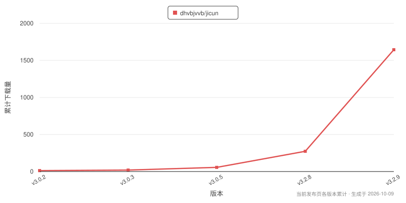

<p align="center">
  
</p>

<h1 align="center">即存 for Android</h1>

<p align="center">
  <strong>粘贴分享链接，视频 / 图片 / 音频 / 文案一次拿到手。</strong>
</p>

<h3 align="center"><a href="https://github.com/dhvbjvvb/jicun/releases/latest">⬇️ 一键下载 APK，装完即用</a></h3>

<p align="center">
  Flutter 写界面，收流、写入相册、装包这几段走 Kotlin 原生。一个 APK 就是全部，不用另装运行库。
</p>

<p align="center"><sub>本程序只做「把你自己的链接解析成直链再下载」：不提供任何内容、不绕过付费或权限。请遵守各内容平台的服务条款与当地法律，使用风险自负。<br>本仓库与任何内容平台均无隶属、合作、授权或背书关系。</sub></p>

<p align="center">
  <a href="https://github.com/dhvbjvvb/jicun/releases/latest"></a>
  <a href="https://github.com/dhvbjvvb/jicun"></a>
  <a href="LICENSE"></a>
  <a href="https://github.com/dhvbjvvb/jicun/actions/workflows/ci.yml"></a>
  
</p>

> 📱 本仓库只发布 Android 端源码。Windows 桌面端见 [jicun-desktop](https://github.com/dhvbjvvb/jicun-desktop)。

## 📥 下载与安装

- 到 [最新发布页](https://github.com/dhvbjvvb/jicun/releases/latest) 下载 APK，手机上点开安装，**支持应用内自动更新**。
- **系统要求**：Android 10（API 29）或更高；体积约 24 MB（arm64）。
- 第一次装的时候会要求你允许「安装未知应用」—— 从浏览器或聊天软件里点开 APK 都会走这一步。
- 发布页挂着通用包和按 CPU 架构拆分的包，**应用内更新会按你手机的架构自己挑**，手动下载随便挑一个装也行。

> **为什么最低 Android 10**：文件写进相册那一步用的是分区存储那套 API（`RELATIVE_PATH` / `IS_PENDING` / 按卷取集合），更老的系统上文件下得下来，却存不进相册。

## ✨ 能干什么

- 🔗 **链接解析**：整段分享文案粘进来会自动挑出链接，也可以点「粘贴」读剪贴板。
- 👀 **预览与清晰度**：视频 / 音频播放器、图集缩略图与全屏看图、可复制的文案卡片；有多个清晰度时弹窗选档（原画 / 720P / 540P…）。
- ⚡ **下载够稳**：8 MB 以上的文件按 Range 切段并行收，段级重试 + 断点续传，连接被重置不会整条重来；几 MB 的小文件不分段。
- 🌙 **退到后台接着下**：下载期间挂着前台服务 + 唤醒锁，切 App、锁屏都不会被清掉；下完就停，通知栏不留常驻通知。
- 🖼 **落盘进相册**：按响应头 + 文件头嗅探真实格式再定后缀（动图不会被存成静态图的名字），重名自动补号，登记进系统媒体库。
- 🧹 **取消 / 失败不留垃圾**：随时可取消，取消不留半截文件；失败的那条删掉，同一批里已经下好的照常进相册。
- 🕘 **历史与通知**：解析历史最多留 200 条、本地留存、支持批量删除；「下载完成 / 失败」通知可分别开关。
- 🔄 **检查更新**：启动时后台查一次，设置页也能手动查；新版弹窗写清这次改了什么，可以「忽略」这一个版本。
- 🎨 **外观**：浅色 / 深色 / 跟随系统，顶栏样式与界面缩放可调。
- ❓ **使用帮助**：内置按平台列出的「能解析什么、怎么操作」；关于页里还藏了个彩蛋 🥚。

## 🌐 支持的平台与内容

| 平台 | 可解析内容 |
|---|---|
| 抖音 | 视频、图片、实况、文案 |
| 快手 | 视频、图片、实况、文案 |
| 小红书 | 视频、图片、实况、文案 |
| 哔哩哔哩 | 有水印视频 |
| 微博 | 图文、视频、实况 |
| 微信公众号 | 视频、图片、文章 |
| 微信视频号 | 视频 |
| 今日头条 | 视频、图片、文章 |
| 西瓜视频 | 视频 |
| 好看视频 | 视频 |
| 豆包 | 无水印图片、无水印视频 |
| 汽水音乐 | 仅免费音乐、MV |
| 皮皮虾 | 视频、图片、文案 |
| 皮皮搞笑 | 视频、图片、文案 |
| 最右 | 视频、图片、实况、文案 |

上面这份就是**全部支持范围**：粘进不在名单里的链接，会在本地直接提示「暂不支持该平台」，不白跑一趟解析。

「可解析内容」按各平台实际能拿到的写，没有往好里凑数 —— 比如哔哩哔哩拿到的视频带水印，就照实说。

## 🔐 权限说明

| 权限 | 用来干什么 |
| --- | --- |
| `INTERNET` | 解析与下载 —— 全部联网行为只有这一件事 |
| `POST_NOTIFICATIONS` | 「下载完成 / 失败」通知；不想看可以在设置里分别关掉 |
| `REQUEST_INSTALL_PACKAGES` | 应用内更新：把下好的 APK 交给系统安装器 |
| `FOREGROUND_SERVICE` + `FOREGROUND_SERVICE_DATA_SYNC` | 下载期间的前台服务，让下载在后台接着跑 |
| `WAKE_LOCK` | 上一条的配套：别让 CPU 睡过去，把下载拖成涓流 |

> **没有存储权限**：写进相册走的是系统媒体库（MediaStore），不需要「读取 / 写入手机存储」那种全家桶权限。选「任意文件夹」保存时用的是系统目录选择器给的授权，只对那一个目录有效。

## ❓ 常见问题

**解析失败？** 多半是链接所在平台改了接口，或者当前网络到上游不通。可以把链接和界面上的报错发到 [Issues](https://github.com/dhvbjvvb/jicun/issues)。

**下载慢？** 同一条 CDN 的速率受运营商和 CDN 侧限速影响很大，跟下载实现是两件事 —— 先分清是链路还是实现，再谈调参。

**相册里找不到刚下好的文件？** 看两处：一是设置里「存储保存位置」如果改成了自定义目录，那批文件不进系统媒体库，得用文件管理器去那个目录看；二是系统媒体库刷新有延迟，退出相册再进一次。

**通知栏那条「正在下载」是什么？** 前台服务的通知，下载期间挂着它是为了不被系统清掉，下完自动消失；不想看到可以在系统设置里把这类通知设为静默。

**更新装不上？** 先在系统里允许「安装未知应用」（App 里点更新时会直接给你跳转入口）。国内网络连 GitHub 时常通时不通，弹窗里也会说明；实在不行到发布页手动下载覆盖安装。

## 🗂 你的数据放在哪

全部在本机，不上传：

| 东西 | 位置 |
| --- | --- |
| 设置与开关 | 应用私有存储（随卸载一起删） |
| 解析历史（最多 200 条） | 应用私有存储 |
| 下载成品 | 系统相册 / 音乐目录：`Movies/Jicun/Video`、`Pictures/Jicun/Picture`、`Music/Jicun/Music`；也可以在设置里改成任意目录（那一档不进系统媒体库） |
| 下载中的分片、封面缓存 | 应用缓存目录（上次被系统杀掉留下的分片，下次启动会清掉） |

程序不要求登录，不采集个人信息；只有解析、下载、检查更新、拉取赞助名单这几件事会联网。「自动粘贴并解析」默认**开启**：回到前台时会读一次剪贴板里的首条链接，读到的内容不出本机，不需要可以在设置里关掉。

## 🛠 构建与测试

需要 Flutter stable、Android SDK、JDK 17。

### 🏗 构建

```bash
git clone https://github.com/dhvbjvvb/jicun.git && cd jicun
flutter pub get

# 接口凭据不入库，先按模板建一份本地文件（缺了编译不过）
cp lib/secrets.example.dart lib/secrets.dart   # Windows: copy lib\secrets.example.dart lib\secrets.dart

flutter build apk --release
```

发布签名要 `android/key.properties` 与对应的 keystore（同样不入库）：缺这两个文件时，产出 release 产物的任务会直接失败，不会静默退回 debug 签名。只想在本机跑一次 release：`flutter build apk --release -PallowDebugSigning=true`（这个包是 debug 签名，别拿去分发）。

### 🧪 测试

```bash
flutter analyze
dart format lib test                 # 格式门：CI 会校验，先本地跑一遍
.\tool\run_tests.ps1                 # 整套跑一遍 → 只把被杀 / 报失败的文件单独再跑（-PerFile 才是逐文件跑）
cd android && ./gradlew :app:testDebugUnitTest
python tool/gen_logic_vectors.py     # 跨端测试向量与实现是否还一致
python tool/check_comment_refs.py    # 注释里点名的标识符必须还在
python tool/check_repo_hygiene.py    # 本机路径 / 依赖源 / 密钥文件 / SDK 版本来源
flutter test integration_test        # 需要真机或模拟器
```

**为什么要逐文件跑**：Windows 上的 `flutter_tester.exe` 有一条引擎级缺陷 —— 它以 `0xc0000005`（访问违例）静默杀掉整个测试进程，一次带走同一文件里剩下的几十条用例。所以整套跑一遍之后，只把「被杀 / 报失败 / 没跑到」的文件单独再跑；断言与异常失败一律不重跑，不给它当遮羞布。改过判据或输出解析就跑一次自检：`.\tool\run_tests.ps1 -SelfCheck`。

覆盖率只做参考、不作门：`flutter test --coverage` 出来的数字两个方向都证不了什么（Widget 渲染天然难覆盖，堆行数又太容易），CI 里那个 job 红了也不拦合并。

## 📄 License

本项目遵循 [MIT License](LICENSE) © 2026 DIOT。

> 本项目完全免费开源。如果有人向你收费出售此软件，请拒绝。<br>
> 本项目只提供「解析你自己有权访问的链接并下载」这一技术能力，不提供任何内容、不破解任何权限或付费墙；请遵守各内容平台的服务条款与当地法律，使用风险自负。

---

<p align="center">📊 <b>下载量</b></p>

<p align="center">
  <a href="https://github.com/dhvbjvvb/jicun/releases"></a>
</p>

<p align="center">
  <a href="https://github.com/dhvbjvvb/jicun/releases"></a>
  <a href="https://github.com/dhvbjvvb/jicun/releases/latest"></a>
  <a href="https://github.com/dhvbjvvb/jicun"></a>
</p>

> 曲线按**版本顺序**累计，不是按日期：GitHub 不公开下载量的历史曲线，接口只给每个包一个总数，发布页上现在也只剩这几个版本。数字取自发布页的下载计数；要更新就跑 `python tool/gen_downloads_chart.py`。
